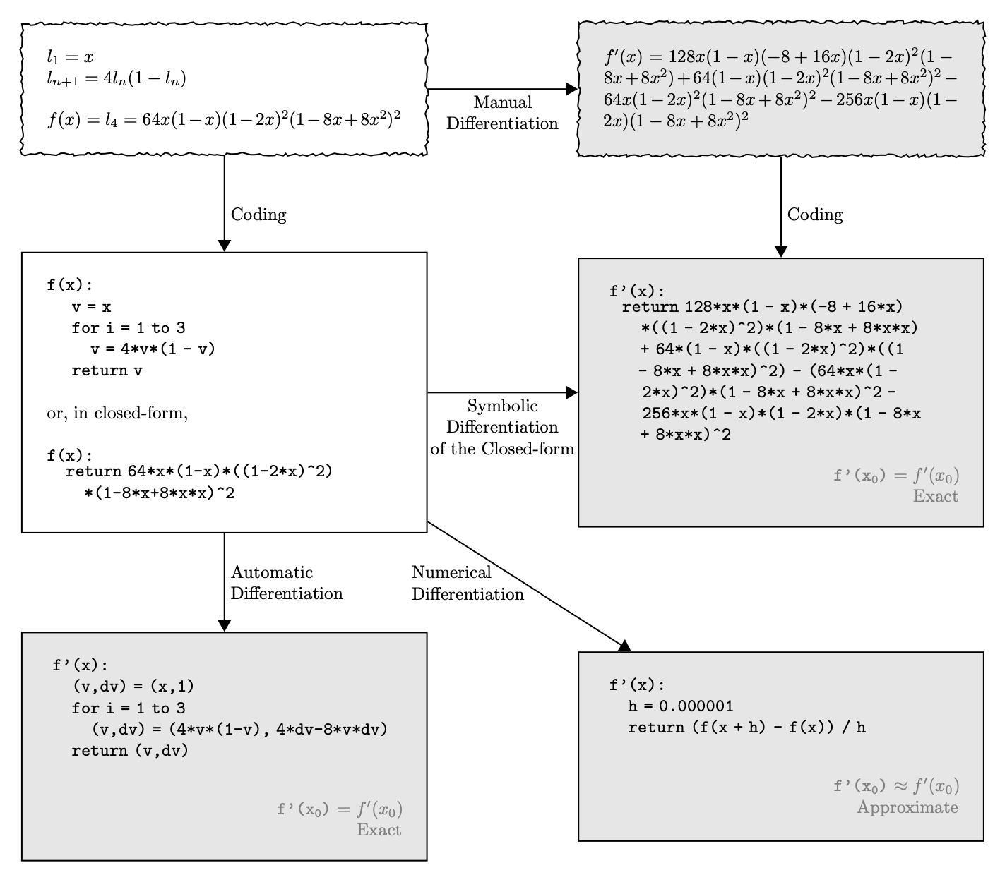
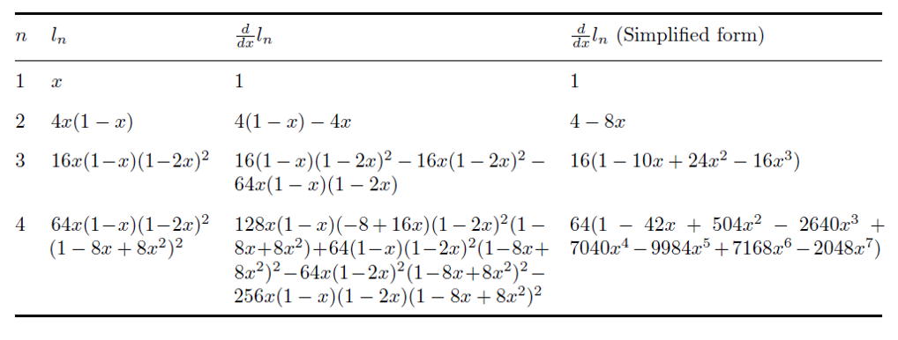
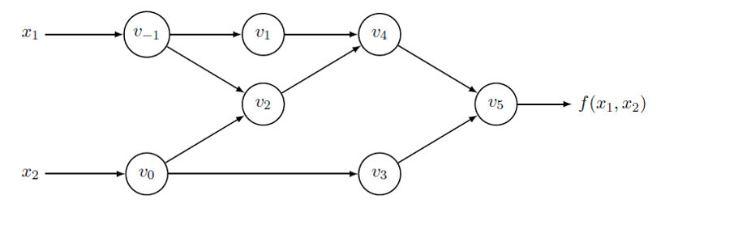
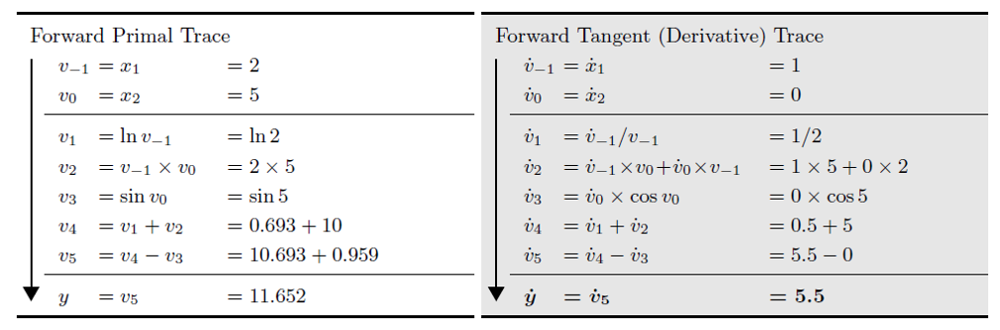
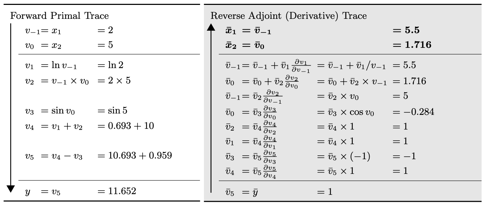
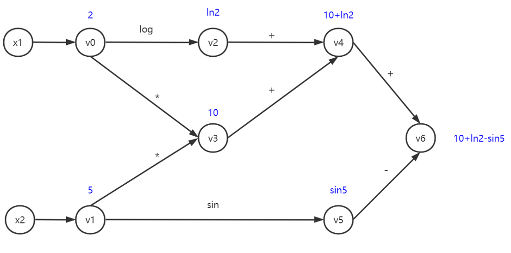
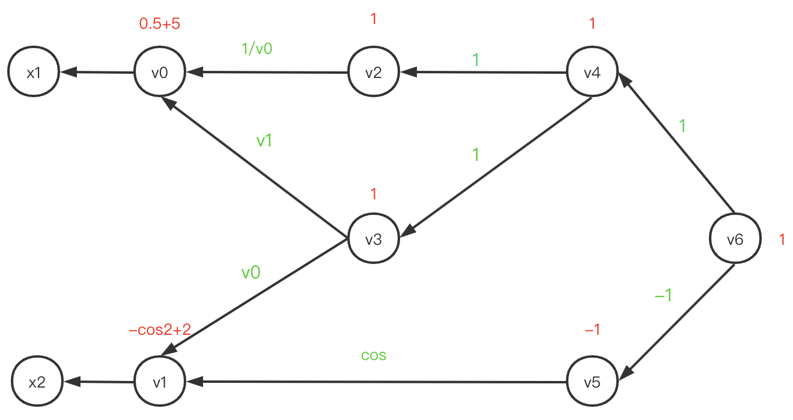

Automatic Differentiation
================================

The optimization process of deep learning models is based on the gradient
descent method. Deep learning frameworks such as PyTorch and Tensorflow can
be divided into three parts: model api, gradient calculation and gpu
acceleration. Gradient calculation plays an important role, and the core
technology of this part is automatic differentiation.

Differential Methods
------------------------------------

There are four differential methods:

* Manual differentiation
* Numerical differentiation
* Symbolic differentiation
* Automatic differentiation

Manual differentiation is to use the derivation formula to manually write the
derivation formula. This method is accurate and effective, and the only
disadvantage is that it takes effort.

Numerical differentiation uses the definition of derivative:

.. math::
    \frac{\partial f(\mathbf{x})}{\partial x_{i}} \approx \frac{f\left(\mathbf{x}+h \mathbf{e}_{i}\right)-f(\mathbf{x})}{h}

This method is simple to implement, but there are two serious problems:
truncation error and roundoff error. But this method can be a good way to
check whether the gradient is accurate.

Another method is symbolic differentiation, which transfers the work we did in
manual differentiation to the computer. The problem with this method is that
the expression must be closed-form, that is, there cannot be loops and
conditional expressions. So that the entire problem can be converted into
a pure mathematical symbol problem can be solved using some algebraic
software. However, when expressions are complex, the problem of "expression
swell" is prone to occur.

The last is our protagonist: automatic differentiation. It is also the most
widely used derivation method in programe.

What is Automatic Differentiation?
------------------------------------

The automatic differentiation discovers the essence of
differential calculation:
**Differential calculation is a combination of a limited series of \
differentiable operators.**

We can regarded the formula

.. math::
    f\left(x_{1}, x_{2}\right)=\ln \left(x_{1}\right)+x_{1} x_{2}-\sin \left(x_{2}\right)

as a calculation graph
(What’s more, it can be regarded as a tree structure, too)
. In the process of forward calculation, we can obtain the value of each node.

Then we can express the derivation process as follows:

.. math::
    \frac{d f}{d x_1} = \frac{d v_{-1}}{d x_1}  \cdot (\frac{d v_1}{d v_{-1}} \cdot \frac{d v_4}{d v_1}  + \frac{d v_2}{d v_{-1}} \cdot \frac{d v_4}{d v_2} )  \cdot \frac{d v_5}{d v_4} \cdot \frac{d f}{d v_5}

It can be seen that the whole derivation can be split into a series of
differential operator combinations. The calculation can be divided into two
types: calculating the formula from forward to backward is called
Forward Mode, and calculating the formula from backward to forward is called
Reverse Mode. The process of the two modes is expressed as follows:

The gradient values calculated by the two modes are the same, but for the
calculation order is different, the calculation speed is different. Generally,
if the Jacobian matrix is relatively high, then the forward mode is more
efficient; if the Jacobian matrix is wider, then the reverse mode is more
efficient.

``JVP``, ``VJP`` and ``vmap``
------------------------------------

If you have used pytorch, you will find that if ``y`` is a tensor instead of a
scalar, you will be asked to pass a  ``grad_variables`` in ``y.backward()``.
And the derivative result ``x.grad`` has the same shape as ``x``.
Where is the Jacobian matrix?

The reason is that deep learning frameworks such as Tensorflow and PyTorch
prohibit the derivatives with tensor by tensor, but only retain scalar by
tensor. When we call ``y.backward()`` and enter a ``grad_variables`` v.
In fact, it actually converts y into a weighted sum ``l = torch.sum(y * v)``,
where ``l`` is a scalar, and then the gradient of ``x.grad`` is naturally
of the same shape as ``x``. The reason for this is that the loss of deep
learning is definitely a scalar, and gradient descent requires that
the gradient must be of the same type as ``x``.

But what if we want to obtain the Jacobian matrix?

The answer is to derive ``x`` for each value of ``y``.In addition,
Google's new deep learning framework JAX uses a more advanced method, the
vectorization operation vmap to speed up the calculation.

Reference
------------------------------------
* `The Autodiff Cookbook <https://jax.readthedocs.io/en/latest/notebooks/autodiff_cookbook.html>`_
* `Automatic Differentiation in Machine Learning: a Survey <https://arxiv.org/pdf/1502.05767.pdf>`_

How to implement ``VJP``?
================================

This article describes how to build an automatic differentiation framework
based on vjp.

Basic vjp differential operator
------------------------------------

The vjp differential operator is the cornerstone of automatic differentiation
system from based on vjp. Because some differential operators are too
complicated and error-prone, we can use the code in `autograd <https://github.com/HIPS/autograd>`_.
The differential operator of A simple binary function is defined as follows:

.. code-block:: python

    defvjp(
        np.subtract,
        lambda ans, x, y : unbroadcast_f(x, lambda g: g),
        lambda ans, x, y : unbroadcast_f(y, lambda g: -g)
    )

The ``defvjp`` registers two differential operators of the function
``np.subtract``. Each requires at least four input parameters.

In the first stage (Build calculation graph), input the calculation result
``ans``, inputs ``x`` and ``y``, other parameters that may influence the
derivative, such as the ``axis`` of `np.sum`. The second stage (back
propagation) inputs the gradient ``g``.

Build calculation graph
------------------------------------

We can express any calculation as a directed acyclic graph. For example, the
formula

.. math::
    f\left(x_{1}, x_{2}\right)=\ln \left(x_{1}\right)+x_{1} x_{2}-\sin \left(x_{2 }\right), \text{assuming } x_1=2, x_2=5

the calculation graph can be expressed as follows:

For back propagation, we need to define a data structure to retain
each node in the calculation graph. Assuming this data structure is
``VJPDiffArray``, the class should have the following attributes:

* ``_id``: The id of the node.

* ``_value``: The value of the node, such as ``ln2``.

* ``_parents``: The nodes that point to the current node, for example, the
  ``_parents`` of ``v4`` is ``[v2, v3]``.

* ``_vjp``: A function that calculates the gradient of the current node to its
  parents. The function inputs ``ans``, ``x``, and ``y`` during forward
  calculation. Then you just need input ``g`` during backward propagation.

All these attributes are assigned by a function called ``register_diff`` during
forward calculation.

Backward propagation
------------------------------------

After constructing the calculation graph, the process of derivation is
relatively simple, we can express it as a back propagation on the calculation
graph:

For each node, we input the gradient of the previous node to current node to
obtain the gradient of the current node to ``_parents``. This process is
implemented by the ``_backward`` function.

How to implement ``JVP``?
================================

``VJP`` is derived from back to front, while ``JVP`` is derived from front to back.
The problems is that it is difficult to implement high-order derivation
in a concise way, because we will also register gradient when we calculate
the derivative, and ``JVP``'s front-to-back computer system will make the program
fall into an infinite loop.

In order to solve this problem, we need to make each ``JVPDiffArray`` self-complete,
that is, it needs to carry all the information needed for its own derivation.

Thus, when calculating the gradient,
it is enough to calculate the stored jvp functions chain
because ``JVPDiffArray`` itself already contains all the required information.

How to implement ``Jacobian``?
================================

After completing the above two parts,
we can easily obtain the jacobian matrix based on them.
``VJP`` is the derivative of ``np.sum(y*v)`` (``v`` is the grad variables) to ``x``,
and the part of the jacobian matrix ``j[i][j]``
(representing the derivative of ``y[i][j]`` to ``x``)
can be regarded as setting the ``v`` in ``VJP`` as a matrix
whose position [i,j] is 1 and all other positions are 0.

How to support higher-order derivative?
========================================
Because we also register the gradient (call ``register_diff``) during
the calculation of gradient, obtaining higher-order differentials
only needs to call the ``to`` function repeatedly.

For more details, please refer to `_diff_array.py <https://github.com/Quansight-Labs/udiff/blob/master/src/udiff/_diff_array.py>`_.
